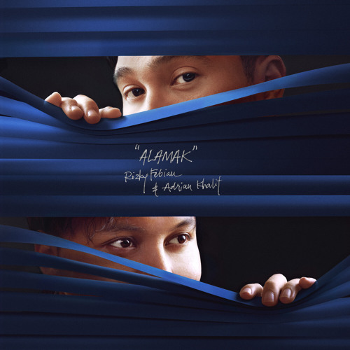

# 🎵 Alamak - Music Player dengan Lirik Sinkronisasi

Player musik romantis untuk lagu "Alamak" oleh Rizky Febian dengan fitur lirik sinkronisasi yang elegan.



## ✨ Fitur Utama

- 🎶 **Player Musik Lengkap** - Kontrol play/pause, progress bar, dan volume  
- 📝 **Lirik Sinkronisasi** - Lirik berganti otomatis sesuai waktu lagu  
- 🎨 **Desain Romantis** - Tampilan elegan dengan gradien pink-ungu dan efek hati  
- 🔄 **Auto-Scroll Cerdas** - Lirik aktif otomatis ter-scroll ke tengah  
- 📱 **Responsif** - Tampilan optimal di desktop dan mobile  
- 💫 **Efek Visual** - Hati mengambang dan animasi album art yang memukau

## 🚀 Cara Menggunakan

1. Persiapan file proyek:
    ```
    project-folder/
    ├── index.html
    ├── audio/
    │   └── Alamak.mp3
    ├── cover/
    │   └── Alamak_albumcover.jpg
    └── icon/
         └── heart.png
    ```

2. Jalankan aplikasi:
    - Buka file `index.html` di browser  
    - Klik tombol play untuk memulai musik  
    - Nikmati lirik yang sinkron dengan lagu

## 🎯 Fitur Khusus

### Auto-Scroll Intelligence
- Lirik aktif otomatis bergerak ke posisi tengah  
- Bebas scroll manual tanpa mengganggu pengalaman  
- Auto-scroll kembali aktif setelah 3 detik tidak scroll

### Desain Romantis
- Gradien warna pink dan ungu yang lembut  
- Efek glassmorphism dengan backdrop-filter  
- Hati mengambang dengan animasi natural  
- Tipografi yang elegan dan mudah dibaca

### Kontrol Player
- Tombol play/pause yang responsif  
- Progress bar yang dapat diklik  
- Slider volume dengan visual yang jelas  
- Display waktu current dan duration

## 🛠️ Teknologi

- **HTML5** - Struktur aplikasi  
- **CSS3** - Styling dengan gradient, animation, dan backdrop-filter  
- **JavaScript** - Logika player dan sinkronisasi lirik  
- **Font Awesome** - Ikon kontrol player

## 🎵 Tentang Lagu

**"Alamak"** oleh **Rizky Febian** adalah lagu romantis yang menceritakan tentang perasaan jatuh cinta yang membuat seseorang merasa terkesima dan berdebar-debar.

## 🌟 Keunikan

- Dibuat khusus untuk satu lagu (Alamak) dengan pengalaman yang optimal
- Timing lirik yang presisi
- Interface yang minimalis dan fokus pada konten
- Efek visual yang memperkuat nuansa romantis lagu

## 📞 Kontak

Dibuat dengan ❤️ untuk penggemar musik Indonesia.

---

*"Alamak, inikah jatuh cinta?"* - Rizky Febian